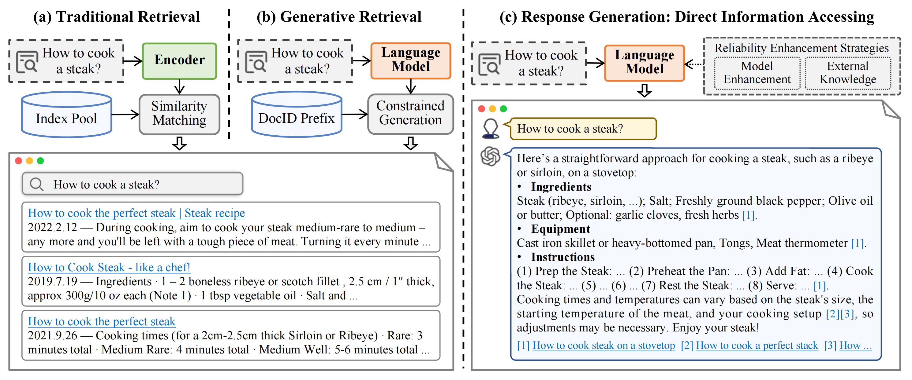

# GenIR-Survey
This repository contains a curated collection of research papers on generative information retrieval. These papers are organized according to the categorizations outlined in our survey "[From Matching to Generation: A Survey on Generative Information Retrieval](https://arxiv.org/abs/2404.xxxxxx)".

> **Short Abstract:** This survey explores generative information retrieval (GenIR), which marks a paradigm shift from traditional matching-based methods to generative approaches. We divide current GenIR research into two main categories: (1) generative document retrieval, which involves retrieval by directly generating document identifiers, without relying on large-scale indexing, and (2) reliable response generation, which uses language models to generate user-centric and reliable responses, directly meets the users' information need. This review aims to offer a comprehensive reference for researchers in the GenIR field, encouraging further development in this area.

#### **Exploring IR Evolution: From Matching to Generation**


## 📋 Table of Contents
1. [Generative Document Retrieval](#generative-document-retrieval)
   - [Model Training and Structure](#model-training-and-structure)
     - [Training](#training)
     - [Structure](#structure)
   - [Document Identifier Design](#document-identifier-design)
     - [Numeric-based](#numeric-based)
     - [Text-based](#text-based)
   - [Incremental Learning](#incremental-learning)
   - [Downstream Task Adaptation](#downstream-task-adaptation)
     - [Separate Training](#separate-training)
     - [Joint Training](#joint-training)
     - [Multi-Modal Generative Retrieval](#multi-modal-generative-retrieval)
   - [Generative Recommender Systems](#generative-recommender-systems)
2. [Reliable Response Generation](#reliable-response-generation)
   - [Internal Knowledge Memorization](#internal-knowledge-memorization)
     - [Structural Design](#structural-design)
     - [Training and Inference](#training-and-inference)
     - [Knowledge Updating](#knowledge-updating)
   - [External Knowledge Augmentation](#external-knowledge-augmentation)
     - [Retrieval Augmentation](#retrieval-augmentation)
     - [Tool Augmentation](#tool-augmentation)
   - [Generating Response with Citation](#generating-response-with-citation)
     - [Direct Generating Citation](#direct-generating-citation)
     - [Retrieval-based Citation](#retrieval-based-citation)
   - [Personal Information Assistant](#personal-information-assistant)
     - [Personalized Dialogue](#personalized-dialogue)
     - [Domain-specific Personalization](#domain-specific-personalization)
3. [Evaluation](#evaluation)
   - [Generative Document Retrieval](#evaluation-generative-document-retrieval)
     - [Metrics](#metrics)
     - [Benchmarks](#benchmarks)
     - [Analysis](#analysis)
   - [Reliable Response Generation](#evaluation-reliable-response-generation)
     - [Metrics](#metrics-1)
     - [Benchmarks](#benchmarks-1)
4. [Challenges and Prospects](#challenges-and-prospects)
   - [Generative Document Retrieval](#challenges-generative-document-retrieval)
   - [Reliable Response Generation](#challenges-reliable-response-generation)
   - [Unified Framework](#unified-framework)

## 📄 Paper List
### Generative Document Retrieval
#### Model Training and Structure
##### **Training**
  1. DSI: **"Transformer Memory as a Differentiable Search Index"**. _Yi Tay et al._ NeurIPS 2022. \[[Paper](http://papers.nips.cc/paper_files/paper/2022/hash/892840a6123b5ec99ebaab8be1530fba-Abstract-Conference.html)\]
  2. DynamicRetriever: **"DynamicRetriever: A Pre-trained Model-based IR System Without an Explicit Index"**. _Yujia Zhou et al._ Mach. Intell. Res., 2023. \[[Paper](https://doi.org/10.1007/s11633-022-1373-9)\]
  3. NCI: **"A Neural Corpus Indexer for Document Retrieval"**. _Yujing Wang et al._ NeurIPS 2022. \[[Paper](https://proceedings.neurips.cc/paper_files/paper/2022/file/a46156bd3579c3b268108ea6aca71d13-Paper-Conference.pdf)\]
  4. DSI-QG: **"Bridging the Gap Between Indexing and Retrieval for Differentiable Search Index with Query Generation"**. _Shengyao Zhuang et al._ arXiv, 2022. \[[Paper](https://doi.org/10.48550/arXiv.2206.10128)\]
  5. **"Understanding Differential Search Index for Text Retrieval"**. _Xiaoyang Chen et al._ ACL 2023. \[[Paper](https://doi.org/10.18653/v1/2023.findings-acl.681)\]
  6. LTRGR: **"Learning to Rank in Generative Retrieval"**. _Yongqi Li et al._ arXiv, 2023. \[[Paper](https://doi.org/10.48550/arXiv.2306.15222)\]
  7. GenRRL: **"Enhancing Generative Retrieval with Reinforcement Learning from Relevance Feedback"**. _Yujia Zhou et al._ EMNLP 2023. \[[Paper](https://aclanthology.org/2023.emnlp-main.768)\]
  8. DGR: **"Distillation Enhanced Generative Retrieval"**. _Peiwen Yuan et al._ arXiv, 2024. \[[Paper](https://arxiv.org/abs/2402.10769)\]
  9. ListGR: **"Listwise Generative Retrieval Models via a Sequential Learning Process"**. _Yubao Tang et al._ ACM Transactions on Information Systems, 2024.
##### **Structure**
  1. TOME: **"TOME: A Two-stage Approach for Model-based Retrieval"**. _Ruiyang Ren et al._ ACL 2023. \[[Paper](https://doi.org/10.18653/v1/2023.acl-long.336)\]
  2. NP Decoding: **"Nonparametric Decoding for Generative Retrieval"**. _Hyunji Lee et al._ ACL 2023. \[[Paper](https://doi.org/10.18653/v1/2023.findings-acl.801)\]
  3. MEVI: **"Model-enhanced Vector Index"**. _Hailin Zhang et al._ arXiv 2023. \[[Paper](https://arxiv.org/abs/2309.13335)\]
  4. DiffusionRet: **"Diffusion-Enhanced Generative Retriever using Constrained Decoding"**. _Shanbao Qiao et al._ EMNLP 2023. \[[Paper](https://aclanthology.org/2023.findings-emnlp.638)\]
  5. GDR: **"Generative Dense Retrieval: Memory Can Be a Burden"**. _Peiwen Yuan et al._ arXiv, 2024. \[[Paper](https://arxiv.org/abs/2401.10487)\]
  6. Self-Retrieval: **"Self-Retrieval: Building an Information Retrieval System with One Large Language Model"**. _Qiaoyu Tang et al._ arXiv 2024. \[[Paper](https://arxiv.org/abs/2403.00801)\]
#### Document Identifier Design
##### **Numeric-based**
  1. DSI: **"Transformer Memory as a Differentiable Search Index"**. _Yi Tay et al._ NeurIPS 2022. \[[Paper](http://papers.nips.cc/paper_files/paper/2022/hash/892840a6123b5ec99ebaab8be1530fba-Abstract-Conference.html)\]
  2. DynamicRetriever: **"DynamicRetriever: A Pre-trained Model-based IR System Without an Explicit Index"**. _Yujia Zhou et al._ Mach. Intell. Res., 2023. \[[Paper](https://doi.org/10.1007/s11633-022-1373-9)\]
  3. Ultran: **"Ultron: An Ultimate Retriever on Corpus with a Model-based Indexer"**. _Yujia Zhou et al._ arXiv, 2022. \[[Paper](https://arxiv.org/abs/2208.09257)\]
  4. GenRet: **"Learning to Tokenize for Generative Retrieval"**. _Weiwei Sun et al._ arXiv, 2023. \[[Paper](https://doi.org/10.48550/arXiv.2304.04171)\]
  5. Tied-Atomic: **"Generative Retrieval as Dense Retrieval"**. _Thong Nguyen et al._ arXiv, 2023. \[[Paper](https://doi.org/10.48550/arXiv.2306.11397)\]
  6. MEVI: **"Model-enhanced Vector Index"**. _Hailin Zhang et al._ arXiv 2023. \[[Paper](https://arxiv.org/abs/2309.13335)\]
  7. LMIndexer: **"Language Models As Semantic Indexers"**. _Bowen Jin et al._ arXiv 2023. \[[Paper](https://arxiv.org/abs/2310.07815)\]
  8. ASI: **"Auto Search Indexer for End-to-End Document Retrieval"**. _Tianchi Yang et al._ EMNLP 2023. \[[Paper](https://aclanthology.org/2023.findings-emnlp.464)\]
  9. RIPOR: **"Scalable and Effective Generative Information Retrieval"**. _Hansi Zeng et al._ arXiv, 2023. \[[Paper](https://doi.org/10.48550/arXiv.2311.09134)\]
##### **Text-based**
  1. GENRE: **"Autoregressive Entity Retrieval"**. _Nicola De Cao et al._ ICLR 2021. \[[Paper](https://openreview.net/forum?id=5k8F6UU39V)\]
  2. SEAL: **"Autoregressive Search Engines: Generating Substrings as Document Identifiers"**. _Michele Bevilacqua et al._ NeurIPS 2022. \[[Paper](http://papers.nips.cc/paper_files/paper/2022/hash/cd88d62a2063fdaf7ce6f9068fb15dcd-Abstract-Conference.html)\]
  3. Ultran: **"Ultron: An Ultimate Retriever on Corpus with a Model-based Indexer"**. _Yujia Zhou et al._ arXiv, 2022. \[[Paper](https://arxiv.org/abs/2208.09257)\]
  4. LLM-URL: **"Large Language Models are Built-in Autoregressive Search Engines"**. _Noah Ziems et al._ ACL 2023. \[[Paper](https://doi.org/10.18653/v1/2023.findings-acl.167)\]
  5. UGR: **"A Unified Generative Retriever for Knowledge-Intensive Language Tasks via Prompt Learning"**. _Jiangui Chen et al._ SIGIR 2023. \[[Paper](https://doi.org/10.1145/3539618.3591631)\]
  6. MINDER: **"Multiview Identifiers Enhanced Generative Retrieval"**. _Yongqi Li et al._ ACL 2023. \[[Paper](https://doi.org/10.18653/v1/2023.acl-long.366)\]
  7. AutoTSG: **"Term-Sets Can Be Strong Document Identifiers For Auto-Regressive Search Engines"**. _Peitian Zhang et al._ arXiv, 2023. \[[Paper](https://doi.org/10.48550/arXiv.2305.13859)\]
  8. SE-DSI: **"Semantic-Enhanced Differentiable Search Index Inspired by Learning Strategies"**. _Yubao Tang et al._ KDD 2023. \[[Paper](https://doi.org/10.1145/3580305.3599903)\]
  9. NOVO: **"NOVO: Learnable and Interpretable Document Identifiers for Model-Based IR"**. _Zihan Wang et al._ CIKM 2023. \[[Paper](https://doi.org/10.1145/3583780.3614993)\]
  10. GLEN: **"GLEN: Generative Retrieval via Lexical Index Learning"**. _Sunkyung Lee et al._ EMNLP 2023. \[[Paper](https://aclanthology.org/2023.emnlp-main.477)\]
#### Incremental Learning
1. DSI++: **"DSI++: Updating Transformer Memory with New Documents"**. _Sanket Mehta Vaibhav et al._ arXiv 2022. \[[Paper](https://arxiv.org/abs/2212.09744)\]
2. DynamicIR: **"Exploring the Practicality of Generative Retrieval on Dynamic Corpora"**. _Soyoung Yoon et al._ 2023. \[[Paper](https://api.semanticscholar.org/CorpusID:258967398)\]
3. **"On the Robustness of Generative Retrieval Models: An Out-of-Distribution Perspective"**. _Yu-An Liu et al._ arXiv, 2023. \[[Paper](https://doi.org/10.48550/arXiv.2306.12756)\]
4. IncDSI: **"IncDSI: Incrementally Updatable Document Retrieval"**. _Varsha Kishore et al._ ICML 2023. \[[Paper](https://proceedings.mlr.press/v202/kishore23a.html)\]
5. CLEVER: **"Continual Learning for Generative Retrieval over Dynamic Corpora"**. _Jiangui Chen et al._ CIKM 2023. \[[Paper](https://doi.org/10.1145/3583780.3614993)\]
6. CorpusBrain++: **"CorpusBrain++: A Continual Generative Pre-Training Framework for Knowledge-Intensive Language Tasks"**. _Jiafeng Guo et al._ arXiv 2024. \[[Paper](https://arxiv.org/abs/2402.16767)\]
#### Downstream Task Adaptation
##### **Separate Training**
  1. GERE: **"GERE: Generative Evidence Retrieval for Fact Verification"**. _Jiangui Chen et al._ arXiv 2022. \[[Paper](https://arxiv.org/abs/2204.05511)\]
  2. CorpusBrain: **"CorpusBrain: Pre-train a Generative Retrieval Model for Knowledge-Intensive Language Tasks"**. _Jiangui Chen et al._ CIKM 2022. \[[Paper](https://doi.org/10.1145/3511808.3557271)\]
  3. GMR: **"Generative Multi-hop Retrieval"**. _Hyunji Lee et al._ EMNLP 2022. \[[Paper](https://doi.org/10.18653/v1/2022.emnlp-main.92)\]
  4. DearDR: **"Data-Efficient Autoregressive Document Retrieval for Fact Verification"**. _James Thorne_. arXiv, 2022. \[[Paper](https://doi.org/10.48550/arXiv.2211.09388)\]
  5. CodeDSI: **"CodeDSI: Differentiable Code Search"**. _Usama Nadeem et al._ arXiv, 2022. \[[Paper](https://doi.org/10.48550/arXiv.2210.00328)\]
  6. UGR: **"A Unified Generative Retriever for Knowledge-Intensive Language Tasks via Prompt Learning"**. _Jiangui Chen et al._ SIGIR 2023. \[[Paper](https://doi.org/10.1145/3539618.3591631)\]
  7. GCoQA: **"Generative retrieval for conversational question answering"**. _Yongqi Li et al._ Inf. Process. Manag., 2023. \[[Paper](https://doi.org/10.1016/j.ipm.2023.103475)\]
  8. Re3val: **"Re3val: Reinforced and Reranked Generative Retrieval"**. _EuiYul Song et al._ arXiv, 2024. \[[Paper](https://doi.org/10.48550/arXiv.2401.16979)\]
##### **Joint Training**
  1. UniGen: **"UniGen: A Unified Generative Framework for Retrieval and Question Answering with Large Language Models"**. _Xiaoxi Li et al._ AAAI 2024. \[[Paper](https://doi.org/10.1609/aaai.v38i8.28714)\]
  2. CorpusLM: **"Towards a Unified Language Model for Knowledge-Intensive Tasks Utilizing External Corpus"**. _Xiaoxi Li et al._ arXiv 2024. \[[Paper](https://arxiv.org/abs/2402.01176)\]
##### **Multi-Modal Generative Retrieval**
  1. IRGen: **"IRGen: Generative Modeling for Image Retrieval"**. _Yidan Zhang et al._ arXiv, 2023. \[[Paper](https://doi.org/10.48550/arXiv.2303.10126)\]
  2. GeMKR: **"Generative Multi-Modal Knowledge Retrieval with Large Language Models"**. _Xinwei Long et al._ arXiv, 2024. \[[Paper](https://doi.org/10.48550/arXiv.2401.08206)\]
  3. GRACE: **"Generative Cross-Modal Retrieval: Memorizing Images in Multimodal Language Models for Retrieval and Beyond"**. _Yongqi Li et al._ arXiv, 2024. \[[Paper](https://doi.org/10.48550/arXiv.2402.10805)\]
#### Generative Recommender Systems
1. P5: **"Recommendation as Language Processing (RLP): A Unified Pretrain, Personalized Prompt & Predict Paradigm (P5)"**. _Shijie Geng et al._ RecSys '22. \[[Paper](https://doi.org/10.1145/3523227.3546767)\]
2. GPT4Rec: **"GPT4Rec: A generative framework for personalized recommendation and user interests interpretation"**. _Jinming Li et al._ arXiv 2023. \[[Paper](https://arxiv.org/abs/2304.03879)\]
3. TIGER: **"Recommender Systems with Generative Retrieval"**. _Shashank Rajput et al._ NeurIPS 2023. \[[Paper](http://papers.nips.cc/paper_files/paper/2023/hash/20dcab0f14046a5c6b02b61da9f13229-Abstract-Conference.html)\]
4. SEATER: **"Generative Retrieval with Semantic Tree-Structured Item Identifiers via Contrastive Learning"**. _Zihua Si et al._ arXiv, 2023. \[[Paper](https://doi.org/10.48550/arXiv.2309.13375)\]
5. IDGenRec: **"Towards LLM-RecSys Alignment with Textual ID Learning"**. _Juntao Tan et al._ arXiv 2024. \[[Paper](https://arxiv.org/abs/2403.19021)\]
6. LCRec: **"Adapting large language models by integrating collaborative semantics for recommendation"**. _Bowen Zheng et al._ arXiv 2023. \[[Paper](https://arxiv.org/abs/2311.09049)\]
7. ColaRec: **"Enhanced Generative Recommendation via Content and Collaboration Integration"**. _Yidan Wang et al._ 2024. \[[Paper](https://api.semanticscholar.org/CorpusID:268723798)\]
### Reliable Response Generation
#### Internal Knowledge Memorization
##### **Structural Design**
  1. GPT3: **"Language models are few-shot learners"**. _Tom B. Brown et al._ NeurIPS 2020. \[[Paper](https://proceedings.neurips.cc/paper/2020/hash/f3f22cb8d9ad9a4f0e802f456cc8c862-Abstract.html)\]
  2. BLOOM: **"BLOOM: A 176B-Parameter Open-Access Multilingual Language Model"**. _Teven Le Scao et al._ arXiv, 2022. \[[Paper](https://doi.org/10.48550/arXiv.2211.05100)\]
  3. LLaMA: **"Llama: Open and efficient foundation language models"**. _Hugo Touvron et al._ arXiv 2023. \[[Paper](https://arxiv.org/abs/2302.13971)\]
  4. PaLM: **"PaLM: Scaling Language Modeling with Pathways"**. _Aakanksha Chowdhery et al._ J. Mach. Learn. Res., 2023. \[[Paper](http://jmlr.org/papers/v24/22-1144.html)\]
  5. Mixtral 8x7B: **"Mixtral of Experts"**. _Albert Q. Jiang et al._ arXiv, 2024. \[[Paper](https://doi.org/10.48550/arXiv.2401.04088)\]
##### **Training and Inference**
  1. **"Unsupervised Improvement of Factual Knowledge in Language Models"**. _Nafis Sadeq et al._ EAACL 2023. \[[Paper](https://doi.org/10.18653/v1/2023.eacl-main.215)\]
  2. FactTune: **"Fine-Tuning or Retrieval? Comparing Knowledge Injection in LLMs"**. _Oded Ovadia et al._ arXiv, 2023. \[[Paper](https://doi.org/10.48550/arXiv.2312.05934)\]
  3. GenRead: **"Generate rather than retrieve: Large language models are strong context generators"**. _Wenhao Yu et al._ arXiv 2022. \[[Paper](https://arxiv.org/abs/2209.10063)\]
  4. RECITE: **"Recitation-augmented language models"**. _Zhiqing Sun et al._ arXiv 2022. \[[Paper](https://arxiv.org/abs/2210.01296)\]
  5. DoLa: **"Decoding by Contrasting Layers Improves Factuality in Large Language Models"**. _Yung{-}Sung Chuang et al._ arXiv, 2023. \[[Paper](https://doi.org/10.48550/arXiv.2309.03883)\]
##### **Knowledge Updating**
  1. Ernie 2.0: **"Ernie 2.0: A continual pre-training framework for language understanding"**. _Yu Sun et al._ AAAI 2020. \[[Paper](https://www.aaai.org/AAAI21Papers/AAAI-9624.SunY.pdf)\]
  2. DAP: **"Continual pre-training of language models"**. _Zixuan Ke et al._ arXiv 2023. \[[Paper](https://arxiv.org/abs/2302.03241)\]
  3. DynaInst: **"Large-scale lifelong learning of in-context instructions and how to tackle it"**. _Jisoo Mok et al._ ACL 2023. \[[Paper](https://doi.org/10.18653/v1/2023.acl-long.910)\]
  4. KE: **"Editing Factual Knowledge in Language Models"**. _Nicola De Cao et al._ EMNLP 2021. \[[Paper](https://doi.org/10.18653/v1/2021.emnlp-main.522)\]
  5. MEND: **"Fast Model Editing at Scale"**. _Eric Mitchell et al._ ICLR 2022. \[[Paper](https://openreview.net/forum?id=0DcZxeWfOPt)\]
  6. ROME: **"Locating and Editing Factual Associations in GPT"**. _Kevin Meng et al._ NeurIPS 2022. \[[Paper](http://papers.nips.cc/paper_files/paper/2022/hash/6f1d43d5a82a37e89b0665b33bf3a182-Abstract-Conference.html)\]
#### External Knowledge Augmentation
##### **Retrieval Augmentation**
  1. RAG: **"Retrieval-Augmented Generation for Knowledge-Intensive NLP Tasks"**. _Patrick S. H. Lewis et al._ NeurIPS 2020. \[[Paper](https://proceedings.neurips.cc/paper/2020/hash/6b493230205f780e1bc26945df7481e5-Abstract.html)\]
  2. RRR: **"Query Rewriting in Retrieval-Augmented Large Language Models"**. _Xinbei Ma et al._ EMNLP 2023. \[[Paper](https://aclanthology.org/2023.emnlp-main.322)\]
  3. ARL2: **"ARL2: Aligning Retrievers for Black-box Large Language Models via Self-guided Adaptive Relevance Labeling"**. _Lingxi Zhang et al._ arXiv, 2024. \[[Paper](https://doi.org/10.48550/arXiv.2402.13542)\]
  4. TOC: **"Tree of Clarifications: Answering Ambiguous Questions with Retrieval-Augmented Large Language Models"**. _Gangwoo Kim et al._ EMNLP 2023. \[[Paper](https://aclanthology.org/2023.emnlp-main.63)\]
  5. BlendFilter: **"BlendFilter: Advancing Retrieval-Augmented Large Language Models via Query Generation Blending and Knowledge Filtering"**. _Haoyu Wang et al._ arXiv, 2024. \[[Paper](https://doi.org/10.48550/arXiv.2402.11129)\]
  6. REPLUG: **"REPLUG: Retrieval-Augmented Black-Box Language Models"**. _Weijia Shi et al._ arXiv, 2023. \[[Paper](https://doi.org/10.48550/arXiv.2301.12652)\]
  7. SKR: **"Self-Knowledge Guided Retrieval Augmentation for Large Language Models"**. _Yile Wang et al._ EMNLP 2023. \[[Paper](https://aclanthology.org/2023.findings-emnlp.691)\]
  8. Self-DC: **"Self-DC: When to retrieve and When to generate? Self Divide-and-Conquer for Compositional Unknown Questions"**. _Hongru Wang et al._ arXiv, 2024. \[[Paper](https://doi.org/10.48550/arXiv.2402.13514)\]
  9. Rowen: **"Retrieve Only When It Needs: Adaptive Retrieval Augmentation for Hallucination Mitigation in Large Language Models"**. _Hanxing Ding et al._ arXiv, 2024. \[[Paper](https://doi.org/10.48550/arXiv.2402.10612)\]
  10. Iter-RetGen: **"Enhancing Retrieval-Augmented Large Language Models with Iterative Retrieval-Generation Synergy"**. _Zhihong Shao et al._ arXiv, 2023. \[[Paper](https://doi.org/10.48550/arXiv.2305.15294)\]
  11. IR-COT: **"Interleaving Retrieval with Chain-of-Thought Reasoning for Knowledge-Intensive Multi-Step Questions"**. _Harsh Trivedi et al._ ACL 2023. \[[Paper](https://doi.org/10.18653/v1/2023.acl-long.557)\]
  12. FLARE: **"Active Retrieval Augmented Generation"**. _Zhengbao Jiang et al._ EMNLP 2023. \[[Paper](https://aclanthology.org/2023.emnlp-main.495)\]
  13. Self-RAG: **"Learning to Retrieve, Generate, and Critique through Self-Reflection"**. _Akari Asai et al._ arXiv, 2023. \[[Paper](https://doi.org/10.48550/arXiv.2310.11511)\]
##### **Tool Augmentation**
  1. ReAct: **"Synergizing Reasoning and Acting in Language Models"**. _Shunyu Yao et al._ NeurIPS 2022. \[[Paper](https://openreview.net/forum?id=tvI4u1ylcqs)\]
  2. WebGPT: **"Browser-assisted question-answering with human feedback"**. _Reiichiro Nakano et al._ arXiv, 2021. \[[Paper](https://arxiv.org/abs/2112.09332)\]
  3. StructGPT: **"A General Framework for Large Language Model to Reason over Structured Data"**. _Jinhao Jiang et al._ EMNLP 2023. \[[Paper](https://aclanthology.org/2023.emnlp-main.574)\]
  4. ToG: **"Think-on-Graph: Deep and Responsible Reasoning of Large Language Model with Knowledge Graph"**. _Jiashuo Sun et al._ arXiv, 2023. \[[Paper](https://doi.org/10.48550/arXiv.2307.07697)\]
  5. RoG: **"Reasoning on Graphs: Faithful and Interpretable Large Language Model Reasoning"**. _Linhao Luo et al._ ICLR 2024. \[[Paper](https://openreview.net/forum?id=tvI4u1ylcqs)\]
  6. Toolformer: **"Language models can teach themselves to use tools"**. _Timo Schick et al._ arXiv 2023. \[[Paper](https://arxiv.org/abs/2302.04761)\]
  7. ToolLLM: **"Facilitating Large Language Models to Master 16000+ Real-world APIs"**. _Yujia Qin et al._ arXiv, 2023. \[[Paper](https://doi.org/10.48550/arXiv.2307.16789)\]
  8. AssistGPT: **"A General Multi-modal Assistant that can Plan, Execute, Inspect, and Learn"**. _Difei Gao et al._ arXiv, 2023. \[[Paper](https://doi.org/10.48550/arXiv.2306.08640)\]
  9. HuggingGPT: **"Solving AI Tasks with ChatGPT and its Friends in Hugging Face"**. _Yongliang Shen et al._ NeurIPS 2023. \[[Paper](http://papers.nips.cc/paper_files/paper/2023/hash/77c33e6a367922d003ff102ffb92b658-Abstract-Conference.html)\]
  10. Visual ChatGPT: **"Talking, Drawing and Editing with Visual Foundation Models"**. _Chenfei Wu et al._ arXiv, 2023. \[[Paper](https://doi.org/10.48550/arXiv.2303.04671)\]
#### Generating Response with Citation
##### **Direct Generating Citation**
  1. According-to Prompting: **"According to ...: Prompting Language Models Improves Quoting from Pre-Training Data"**. _Orion Weller et al._ EACL 2024. \[[Paper](https://aclanthology.org/2024.eacl-long.140)\]
  2. IFL: **"Towards Reliable and Fluent Large Language Models: Incorporating Feedback Learning Loops in QA Systems"**. _Dongyub Lee et al._ arXiv, 2023. \[[Paper](https://doi.org/10.48550/arXiv.2309.06384)\]
  3. Fierro et al.: **"Learning to Plan and Generate Text with Citations"**. _Constanza Fierro et al._ arXiv 2024. \[[Paper](https://arxiv.org/abs/2404.03381)\]
  4. 1-PAGER: **"One Pass Answer Generation and Evidence Retrieval"**. _Palak Jain et al._ EMNLP 2023. \[[Paper](https://doi.org/10.18653/v1/2023.findings-emnlp.967)\]
  5. Credible without Credit: **"Domain Experts Assess Generative Language Models"**. _Denis Peskoff et al._ ACL 2023. \[[Paper](https://doi.org/10.18653/v1/2023.acl-short.37)\]
  6. **"Source-Aware Training Enables Knowledge Attribution in Language Models"**. _Muhammad Khalifa et al._ 2024. \[[Paper](https://api.semanticscholar.org/CorpusID:268819100)\]
##### **Retrieval-based Citation**
  1. WebGPT: **"Browser-assisted question-answering with human feedback"**. _Reiichiro Nakano et al._ arXiv, 2021. \[[Paper](https://arxiv.org/abs/2112.09332)\]
  2. WebBrain: **"Learning to Generate Factually arXivect Articles for Queries by Grounding on Large Web Corpus"**. _Hongjing Qian et al._ arXiv, 2023. \[[Paper](https://doi.org/10.48550/arXiv.2304.04358)\]
  3. RARR: **"Researching and Revising What Language Models Say, Using Language Models"**. _Luyu Gao et al._ ACL 2023. \[[Paper](https://doi.org/10.18653/v1/2023.acl-long.910)\]
  4. Search-in-the-Chain: **"Towards the Accurate, Credible and Traceable Content Generation for Complex Knowledge-intensive Tasks"**. _Shicheng Xu et al._ arXiv, 2023. \[[Paper](https://doi.org/10.48550/arXiv.2304.14732)\]
  5. LLatrieval: **"LLM-Verified Retrieval for Verifiable Generation"**. _Xiaonan Li et al._ arXiv, 2023. \[[Paper](https://doi.org/10.48550/arXiv.2311.07838)\]
  6. VTG: **"Towards Verifiable Text Generation with Evolving Memory and Self-Reflection"**. _Hao Sun et al._ arXiv, 2023. \[[Paper](https://doi.org/10.48550/arXiv.2312.09075)\]
  7. CEG: **"Citation-Enhanced Generation for LLM-based Chatbots"**. _Weitao Li et al._ arXiv, 2024. \[[Paper](https://doi.org/10.48550/arXiv.2402.16063)\]
  8. APO: **"Improving Attributed Text Generation of Large Language Models via Preference Learning"**. _Dongfang Li et al._ arXiv, 2024. \[[Paper](https://doi.org/10.48550/arXiv.2403.18381)\]
#### Personal Information Assistant
##### **Personalized Dialogue**
  1. **"Personalizing Dialogue Agents: I have a dog, do you have pets too?"** _Saizheng Zhang et al._ ACL 2018. \[[Paper](https://aclanthology.org/P18-1205/)\]
  2. P2Bot: **"You Impress Me: Dialogue Generation via Mutual Persona Perception"**. _Qian Liu et al._ ACL 2020. \[[Paper](https://doi.org/10.18653/v1/2020.acl-main.131)\]
  3. **"Personalized Response Generation via Generative Split Memory Network"**. _Yuwei Wu et al._ NAACL-HLT 2021. \[[Paper](https://doi.org/10.18653/v1/2021.naacl-main.157)\]
  4. SAFARI: **"Large Language Models as Source Planner for Personalized Knowledge-grounded Dialogues"**. _Hongru Wang et al._ EMNLP 2023. \[[Paper](https://doi.org/10.18653/v1/2023.findings-emnlp.641)\]
  5. Personalized Soups: **"Personalized Large Language Model Alignment via Post-hoc Parameter Merging"**. _Joel Jang et al._ arXiv, 2023. \[[Paper](https://doi.org/10.48550/arXiv.2310.11564)\]
  6. OPPU: **"Democratizing Large Language Models via Personalized Parameter-Efficient Fine-tuning"**. _Zhaoxuan Tan et al._ arXiv, 2024. \[[Paper](https://doi.org/10.48550/arXiv.2402.04401)\]
##### **Domain-specific Personalization**
  1. Zhongjing: **"Enhancing the Chinese Medical Capabilities of Large Language Model through Expert Feedback and Real-World Multi-Turn Dialogue"**. _Songhua Yang et al._ AAAI 2024. \[[Paper](https://doi.org/10.1609/aaai.v38i17.29907)\]
  2. Psy-LLM: **"Scaling up Global Mental Health Psychological Services with AI-based Large Language Models"**. _Tin Lai et al._ arXiv, 2023. \[[Paper](https://doi.org/10.48550/arXiv.2307.11991)\]
    3. Pharmacygpt: **"The ai pharmacist"**. _Zhengliang Liu et al._ arXiv, 2023. \[[Paper](https://arxiv.org/abs/2307.10432)\]
    4. Radiology-Llama2: **"Best-in-Class Large Language Model for Radiology"**. _Zhengliang Liu et al._ arXiv, 2023. \[[Paper](https://doi.org/10.48550/arXiv.2309.06419)\]
    5. EduChat: **"A large-scale language model-based chatbot system for intelligent education"**. _Yuhao Dan et al._ arXiv 2023. \[[Paper](https://arxiv.org/abs/2308.02773)\]
### Evaluation
#### Generative Document Retrieval
##### **Metrics**
  1. MRR: **"Mean Reciprocal Rank"**. _Nick Craswell_. Encyclopedia of Database Systems, 2009. \[[Paper](https://doi.org/10.1007/978-0-387-39940-9_488)\]
  2. nDCG: **"Cumulated gain-based evaluation of IR techniques"**. _Kalervo Järvelin and Jaana Kekäläinen_. ACM TOIS, 2002. \[[Paper](http://doi.acm.org/10.1145/582415.582418)\]
##### **Benchmarks**
  1. MS MARCO: **"MS MARCO: A Human Generated Machine Reading Comprehension Dataset"**. _Tri Nguyen et al._ CoCoNIPS 2016. \[[Paper](https://ceur-ws.org/Vol-1773/CoCoNIPS_2016_paper9.pdf)\]
  2. NQ: **"Natural questions: a benchmark for question answering research"**. _Tom Kwiatkowski et al._ TACL, 2019. \[[Paper](https://www.transacl.org/ojs/index.php/tacl/article/view/1672)\]
  3. TriviaQA: **"T-rex: A large scale alignment of natural language with knowledge base triples"**. _Hady Elsahar et al._ LREC, 2018. \[[Paper](https://www.aclweb.org/anthology/L18-1621/)\]
  4. KILT: **"KILT: a Benchmark for Knowledge Intensive Language Tasks"**. _Fabio Petroni et al._ NAACL 2021. \[[Paper](https://aclanthology.org/2021.naacl-main.200)\]
  5. TREC DL 19 & 20: **"Overview of the TREC 2019 deep learning track"**. _Nick Craswell et al._ arXiv, 2020 & 2021. \[[Paper 2019](https://arxiv.org/abs/2003.07820), [Paper 2020](https://arxiv.org/abs/2102.07662)\]
##### **Analysis**
  1. **"Understanding Differential Search Index for Text Retrieval"**. _Xiaoyang Chen et al._ ACL 2023. \[[Paper](https://doi.org/10.18653/v1/2023.findings-acl.681)\]
  2. **"How Does Generative Retrieval Scale to Millions of Passages?"**. _Ronak Pradeep et al._ EMNLP 2023. \[[Paper](https://aclanthology.org/2023.emnlp-main.83)\]
  3. **"On the Robustness of Generative Retrieval Models: An Out-of-Distribution Perspective"**. _Yu-An Liu et al._ arXiv, 2023. \[[Paper](https://doi.org/10.48550/arXiv.2306.12756)\]
#### Reliable Response Generation
##### **Metrics**
  1. BLEU: **"Bleu: a Method for Automatic Evaluation of Machine Translation"**. _Kishore Papineni et al._ ACL 2002. \[[Paper](https://aclanthology.org/P02-1040/)\]
  2. ROUGE: **"ROUGE: A Package for Automatic Evaluation of Summaries"**. _Chin-Yew Lin_. ACL, 2004. \[[Paper](https://api.semanticscholar.org/CorpusID:964287)\]
  3. BERTScore: **"BERTScore: Evaluating Text Generation with BERT"**. _Tianyi Zhang et al._ ICLR 2020. \[[Paper](https://openreview.net/forum?id=SkeHuCVFDr)\]
  4. BLEURT: **"BLEURT: Learning Robust Metrics for Text Generation"**. _Thibault Sellam et al._ ACL 2020. \[[Paper](https://aclanthology.org/2020.acl-main.704)\]
  5. GPTScore: **"GPTScore: Evaluate as You Desire"**. _Jinlan Fu et al._ arXiv, 2023. \[[Paper](https://doi.org/10.48550/arXiv.2302.04166)\]
  6. FActScore: **"FActScore: Fine-grained Atomic Evaluation of Factual Precision in Long Form Text Generation"**. _Sewon Min et al._ EMNLP 2023. \[[Paper](https://aclanthology.org/2023.emnlp-main.741)\]
##### **Benchmarks**
  1. MMLU: **"Measuring Massive Multitask Language Understanding"**. _Dan Hendrycks et al._ ICLR 2021. \[[Paper](https://openreview.net/forum?id=d7KBjmI3GmQ)\]
  2. BIG-bench: **"Beyond the Imitation Game: Quantifying and extrapolating the capabilities of language models"**. _Aarohi Srivastava et al._ arXiv, 2022. \[[Paper](https://doi.org/10.48550/arXiv.2206.04615)\]
  3. LLM-Eval: **"Unified Multi-Dimensional Automatic Evaluation for Open-Domain Conversations with Large Language Models"**. _Yen-Ting Lin et al._ arXiv, 2023. \[[Paper](https://doi.org/10.48550/arXiv.2305.13711)\]
  4. API-Bank: **"API-Bank: A Comprehensive Benchmark for Tool-Augmented LLMs"**. _Minghao Li et al._ EMNLP 2023. \[[Paper](https://aclanthology.org/2023.emnlp-main.187)\]
  5. ToolBench: **"Generative Retrieval as Dense Retrieval"**. _Thong Nguyen et al._ arXiv, 2023. \[[Paper](https://doi.org/10.48550/arXiv.2306.11397)\]
  6. TruthfulQA: **"TruthfulQA: Measuring How Models Mimic Human Falsehoods"**. _Stephanie Lin et al._ ACL 2022. \[[Paper](https://doi.org/10.18653/v1/2022.acl-long.229)\]
  7. ALCE: **"Auto Search Indexer for End-to-End Document Retrieval"**. _Tianchi Yang et al._ EMNLP 2023. \[[Paper](https://aclanthology.org/2023.findings-emnlp.464)\]
  8. HaluEval: **"A Large-Scale Hallucination Evaluation Benchmark for Large Language Models"**. _Junyi Li et al._ EMNLP 2023. \[[Paper](https://aclanthology.org/2023.emnlp-main.397)\]
  9. RealTime QA: **"RealTime QA: What's the Answer Right Now?"**. _Jungo Kasai et al._ NeurIPS 2023. \[[Paper](http://papers.nips.cc/paper_files/paper/2023/hash/9941624ef7f867a502732b5154d30cb7-Abstract-Datasets_and_Benchmarks.html)\]
  10. FreshQA: **"FreshLLMs: Refreshing Large Language Models with Search Engine Augmentation"**. _Tu Vu et al._ arXiv, 2023. \[[Paper](https://doi.org/10.48550/arXiv.2310.03214)\]
  11. SafetyBench: **"SafetyBench: Evaluating the Safety of Large Language Models with Multiple Choice Questions"**. _Zhexin Zhang et al._ arXiv, 2023. \[[Paper](https://doi.org/10.48550/arXiv.2309.07045)\]
  12. TrustGPT: **"TrustGPT: A Benchmark for Trustworthy and Responsible Large Language Models"**. _Yue Huang et al._ arXiv, 2023. \[[Paper](https://doi.org/10.48550/arXiv.2306.11507)\]
  13. TrustLLM: **"TrustLLM: Trustworthiness in Large Language Models"**. _Lichao Sun et al._ arXiv, 2024. \[[Paper](https://doi.org/10.48550/arXiv.2401.05561)\]
### Challenges and Prospects
#### Generative Document Retrieval
- **Scalability**
- **Dynamic Corpora**
- **Document Representation**
- **Efficiency**
#### Reliable Response Generation
- **Accuracy and Factuality**
- **Real-time Property**
- **Bias and Fairness**
- **Privacy and Security**
#### Unified Framework
- **Unified Framework for Retrieval and Generation**
- **Towards End2end Framework for Various IR Tasks**

## 💡 Other Resources
### Awesome Lists
1. **awesome-generative-information-retrieval**. [[Github](https://github.com/gabriben/awesome-generative-information-retrieval)]
2. **awesome-generative-retrieval-models**. [[Github](https://github.com/Chriskuei/awesome-generative-retrieval-models)]
### Workshops
1. **"Gen-IR@SIGIR 2023: The First Workshop on Generative Information Retrieval"**. _Gabriel Bénédict et al._ SIGIR 23. [[link](https://coda.io/@sigir/gen-ir)]
2. **"The 1st Workshop on Recommendation with Generative Models"**. _Wenjie Wang et al._ CIKM 23. [[link](https://rgm-cikm23.github.io/)]
3. **"Gen-IR@SIGIR 2024: The Second Workshop on Generative Information Retrieval"**. _Gabriel Bénédict et al._ SIGIR 24. [[link](https://coda.io/@sigir/gen-ir)]
### Surveys
1. **"A Survey of Large Language Models"**. _Wayne Xin Zhao et al._ arXiv 2023. \[[Paper](https://arxiv.org/abs/2303.18223)\]
3. **"A Comprehensive Survey of AI-Generated Content (AIGC): A History of Generative AI from GAN to ChatGPT"**. _Yihan Cao et al._ arXiv 2023. \[[Paper](https://arxiv.org/abs/2303.04226)\]
4. **"A Survey on Evaluation of Large Language Models"**. _Yupeng Chang et al._ arXiv 2023. \[[Paper](https://arxiv.org/abs/2307.03109)\]
5. **"Large language models for information retrieval: A survey"**. _Yutao Zhu et al._ arXiv 2023. \[[Paper](https://arxiv.org/pdf/2308.07107.pdf)\]
6. **"Bias and Fairness in Large Language Models: A Survey"**. _Isabel O. Gallegos et al._ arXiv 2023. \[[Paper](https://arxiv.org/abs/2309.00770)\]
7. **"Survey on Factuality in Large Language Models: Knowledge, Retrieval and Domain-Specificity"**. _Cunxiang Wang et al._ arXiv 2023. \[[Paper](https://arxiv.org/abs/2310.07521)\]
8. **"A Survey on Detection of LLMs-Generated Content"**. _Xianjun Yang et al._ arXiv 2023. \[[Paper](https://arxiv.org/abs/2310.15654)\]
9. **"Knowledge Editing for Large Language Models: A Survey"**. _Song Wang et al._ arXiv 2023. \[[Paper](https://arxiv.org/abs/2310.16218)\]
10. **"A Survey of Knowledge Editing of Neural Networks"**. _Vittorio Mazzia et al._ arXiv 2023. \[[Paper](https://arxiv.org/abs/2310.19704)\]
11. **"A Survey on Hallucination in Large Language Models: Principles, Taxonomy, Challenges, and Open Questions"**. _Lei Huang et al._ arXiv 2023. \[[Paper](https://arxiv.org/abs/2311.05232)\]
12. **"A Survey of Large Language Models Attribution"**. _Dongfang Li et al._ arXiv 2023. \[[Paper](https://arxiv.org/abs/2311.03731)\]
14. **"Retrieval-Augmented Generation for Large Language Models: A Survey"**. _Yunfan Gao et al._ arXiv 2024. \[[Paper](https://arxiv.org/abs/2312.10997)\]
### Opining Papers
1. **"Rethinking Search: Making Domain Experts out of Dilettantes"**. _Donald Metzler et al._ SIGIR Forum 2021. \[[Paper](https://arxiv.org/pdf/2105.02274.pdf)\]
2. **"Large Search Model: Redefining Search Stack in the Era of LLMs"**. _Liang Wang et al._ SIGIR Forum 2023. \[[Paper](https://doi.org/10.1145/3642979.3643006)\]
3. **"Information Retrieval Meets Large Language Models: A Strategic Report from Chinese IR Community"**. _Qingyao Ai et al._ arXiv 2023. \[[Paper](https://arxiv.org/pdf/2307.09751.pdf)\]

## 🌟 Citation
Please kindly cite our paper if helps your research:
```BibTex

```
## License
This project is released under the [MIT License](https://github.com/RUC-NLPIR/GenIR-Survey/blob/main/LICENSE).
## Contact
Feel free to contact us if you find a mistake or have any advice. Email: xiaoxi_li@ruc.edu.cn and dou@ruc.edu.cn.

